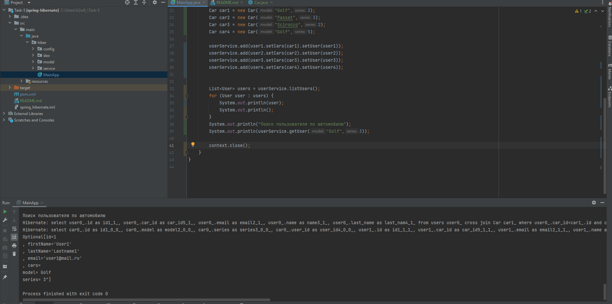

Задание:

Создайте соединение к своей базе данных и схему. Запустите приложение. Проверьте, что оно полностью работает.

Создайте сущность Car с полями String model и int series, на которую будет ссылаться User с помощью связи one-to-one.

Добавьте этот класс в настройки hibernate.

Создайте несколько пользователей с машинами, добавьте их в базу данных, вытащите обратно.

В сервис добавьте метод, который с помощью hql-запроса будет доставать юзера, владеющего машиной по ее модели и серии.
ц